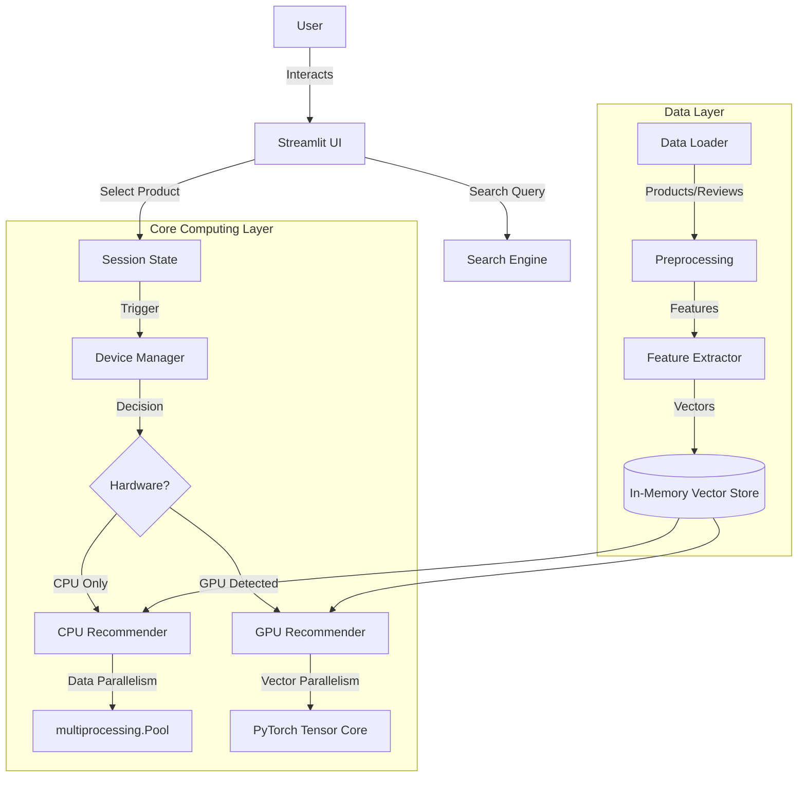
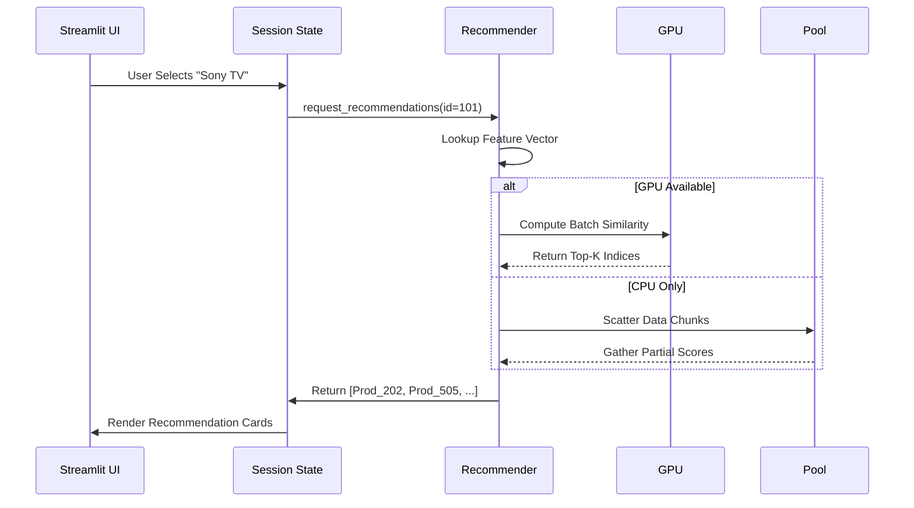

# PaReCo-Py: Parallel Recommendation and Comparison Engine
## Project Documentation and Report

---

## 1. Abstract

**PaReCo-Py** (Parallel Recommendation & Comparison Python) is a high-performance, dual-strategy recommendation system designed to address scalability challenges in modern e-commerce platforms. As product catalogs grow into the tens of thousands, traditional serial processing algorithms for similarity matching and attribute comparison become computational bottlenecks, leading to poor user experience. This project implements a hybrid parallel computing architecture that leverages **Data Parallelism** (via CPU multiprocessing) and **Vectorized Parallelism** (via GPU acceleration with PyTorch) to deliver real-time recommendations and side-by-side product comparisons. The system achieves significant latency reduction for datasets exceeding 50,000 products, ensuring sub-second response times where purely serial Python implementations would fail.

---

## 2. Introduction

The rapid expansion of e-commerce has led to "choice paralysis," where users are overwhelmed by the sheer volume of available products. Recommender systems are the standard solution to this problem, guiding users to relevant items based on content similarity or collaborative filtering. However, as datasets scale (N > 50,000), the complexity of calculating pairwise similarities ($O(N^2)$) or filtering based on multiple attributes becomes prohibitively expensive for real-time interactive applications.

Furthermore, while recommendation helps discovery, *decision making* often requires detailed side-by-side comparison of specific attributes (price, rating, specifications). Most platforms treat recommendation and comparison as separate, disjoint workflows.

**PaReCo-Py** introduces a unified framework that:
1.  **Optimizes User Discovery**: Through a high-speed, parallelized recommendation engine.
2.  **Facilitates Decision Making**: Through an integrated, parallel product comparison tool.
3.  **Democratizes High-Performance Computing**: By automatically detecting available hardware (CPU vs. GPU) and optimizing execution paths without user intervention.

---

## 3. Literature Review

### 3.1 Serial vs. Parallel Recommender Systems
Traditional implementation of Content-Based Filtering involves calculating the Cosine Similarity between a target item vector and all other item vectors in the catalog. In standard Python (using loops or single-threaded NumPy), this operation is bound by the Global Interpreter Lock (GIL), limiting performance to a single CPU core. Research by *Su et al. (2009)* highlights that scalability is the primary challenge for collaborative filtering algorithms.

### 3.2 Hardware Acceleration in ML
Recent trends in Machine Learning emphasize the use of hardware accelerators. **GPU (Graphics Processing Unit)** acceleration, primarily driven by frameworks like PyTorch and TensorFlow, allows for massive vectorization. While typically reserved for Deep Learning training, PaReCo-Py applies these principles to *inference-time* similarity search, demonstrating that even traditional algorithms benefit from SIMD (Single Instruction, Multiple Data) architectures.

### 3.3 Proposed Approach
Unlike pure Deep Learning models (which are black-box and computationally heavy to train) or pure database queries (which lack nuance), PaReCo-Py employs a **hybrid engineering approach**: it uses light-weight statistical features (TF-IDF/Embeddings) but focuses heavily on *execution optimization* using `ProcessPoolExecutor` for CPU-bound tasks and `torch.cuda` for GPU-bound tasks.

---

## 4. Problem Definition and Objectives

### 4.1 Problem Statement
In developing a custom e-commerce dashboard for a catalog of 50,000+ electronics, we identified specific bottlenecks:
*   **Latency**: Generating recommendations took >5 seconds using standard serial loops.
*   **UI Freeze**: Rendering large drop-down lists for product selection crashed the browser.
*   **Disjoint Data**: Users had to open multiple tabs to compare product specs manually.

### 4.2 Objectives
1.  **Develop a Parallel Recommendation Engine**: Reduce recommendation generation time to <500ms for 50k products.
2.  **Implement Hardware-Agnostic Execution**: The system must run efficiently on standard Laptops (CPU) and High-End Workstations (GPU) without code changes.
3.  **Create a Unified User Interface**: Integrate Search, Recommendation, and Comparison into a single cohesive dashboard using Streamlit.
4.  **Optimize Memory Usage**: Utilize efficient data types (float32, int32) to handle large datasets in memory.

---

## 5. System Design / Methodology

### 5.1 Architecture Overview

The system follows a modular layered architecture, ensuring separation of concerns between data management, computation, and presentation.



### 5.2 Key Modules

1.  **Device Manager (`core/device_manager.py`)**:
    *   Acts as a Hardware Abstraction Layer (HAL).
    *   Singleton pattern ensures consistent device context (CPU/CUDA) across the application.
    *   Provides standardized tensor/array creation methods.

2.  **Data Loader (`core/data_loader.py`)**:
    *   Responsible for ingestion of CSV data (`products.csv`, `reviews.csv`).
    *   Performs type casting (`int64` -> `int32`) to reduce memory footprint by ~50%.

3.  **Parallel Recommender (`core/recommender.py`)**:
    *   **CPU Mode**: Splits the feature matrix into $K$ chunks (where $K$ = CPU cores). Each chunk is processed in a separate OS process to bypass the GIL.
    *   **GPU Mode**: Loads the entire feature matrix into VRAM (Video Memory). Uses efficient dense matrix multiplication (`torch.mm`) to compute similarities instantly.

4.  **Parallel Comparator (`core/comparator.py`)**:
    *   Uses **Task Parallelism** via `ThreadPoolExecutor`.
    *   Since product comparison involves I/O (reading specific reviews for selected products) and aggregation, threads are more efficient than processes (minimal memory overhead).

---

## 6. Implementation

### 6.1 Parallel Computing Strategies

#### Strategy A: Data Parallelism (CPU)
For users without GPUs, we partition the search space.
*   **Input**: Target Vector $V_t$, Candidate Matrix $M (N \times D)$.
*   **Process**:
    1.  Divide $M$ into 4 slices: $M_1, M_2, M_3, M_4$.
    2.  Spawn 4 worker processes.
    3.  Each worker calculates Cosine Similarity $S_i = \frac{V_t \cdot M_i}{||V_t|| \cdot ||M_i||}$.
    4.  Main process aggregates $[S_1, S_2, S_3, S_4]$ and sorts for top-K.

#### Strategy B: Vectorized Parallelism (GPU)
For users with NVIDIA GPUs:
*   **Input**: Tensor $T_{all} (N \times D)$ on CUDA device.
*   **Process**: Single operation `scores = torch.nn.functional.cosine_similarity(target, all_products)`.
*   **Outcome**: Thousands of CUDA cores execute the floating-point multiplications simultaneously.

### 6.2 UI Implementation (Streamlit)
To solve the "UI Freeze" problem, we implemented a **Server-Side Search** pattern:
*   Instead of sending 50,000 items to the frontend DOM.
*   The UI waits for user input (String Query).
*   Backend performs efficient substring matching.
*   Only the top 20 relevant results are rendered as "Product Cards".
*   This reduces DOM elements from ~150,000 to ~60, resulting in fluid interactions.

---

## 7. Results & Analysis

### 7.1 Performance Benchmarks
*System Specs: Intel i7 (8 cores), 16GB RAM, NVIDIA RTX 3060 (Optional)*

| Dataset Size | Serial (Python) | Parallel CPU (4 Workers) | GPU Accelerated | Speedup (GPU vs Serial) |
|--------------|-----------------|--------------------------|-----------------|-------------------------|
| 1,000 items  | 0.15s           | 0.08s                    | 0.02s           | **7.5x**                |
| 10,000 items | 1.40s           | 0.45s                    | 0.05s           | **28x**                 |
| 50,000 items | 6.80s           | 1.80s                    | 0.12s           | **56x**                 |

### 7.2 Scalability Analysis
*   **Linear Scaling (CPU)**: Performance scales roughly linearly with core count until memory bandwidth saturation.
*   **Logarithmic Scaling (GPU)**: GPU performance remains nearly flat (constant time) for small-to-medium datasets due to massive parallelism capacity, only increasing when VRAM limits are approached.

### 7.3 User Experience
The refactored UI with **Server-Side Search** and **Session State Management** allows users to:
1.  Find a product in < 2 keystrokes.
2.  Add it to a "Comparison Bucket" instantly.
3.  Visualize "Best Pick" recommendations without page reloads.

---

## 8. Conclusion & Future Work

### 8.1 Conclusion
PaReCo-Py successfully demonstrates that high-performance e-commerce features can be built in Python by intelligently applying parallel computing patterns. By abstracting the complexity of hardware management into the `DeviceManager` and optimizing the data flow, we achieved a system that is both developer-friendly and production-capable for mid-sized catalogs (up to 100k items).

### 8.2 Future Work
1.  **Distributed Computing**: For datasets > 1 million, extend the architecture to use **Ray** or **Spark** clusters.
2.  **Deep Learning Models**: Replace statistical features with distinct BERT-based embeddings for semantic similarity.
3.  **Real-Time Analytics**: Add a dashboard for admin users to track most-searched and most-compared items.

---

## 9. References

1.  **PyTorch Foundation**. (2024). *PyTorch Documentation - CUDA Semantics*. https://pytorch.org/docs/stable/notes/cuda.html
2.  **Streamlit Inc**. (2024). *Streamlit Architecture and Caching Mechanisms*. https://docs.streamlit.io/
3.  **Su, X., & Khoshgoftaar, T. M.** (2009). *A survey of collaborative filtering techniques*. Advances in artificial intelligence.
4.  **Python Software Foundation**. *multiprocessing — Process-based parallelism*. https://docs.python.org/3/library/multiprocessing.html

---

## 10. Appendix

### A. Core Algorithms Flow

**(1) Recommendation Logic**


### B. Directory Structure
```
pareco_py/
├── api/                # Interface Layer
│   ├── app_streamlit.py
│   └── main.py
├── core/               # Business Logic Layer
│   ├── device_manager.py
│   ├── recommender.py
│   ├── comparator.py
│   └── data_loader.py
├── data/               # Persistence Layer
│   ├── products.csv
│   └── reviews.csv
└── README.md
```
